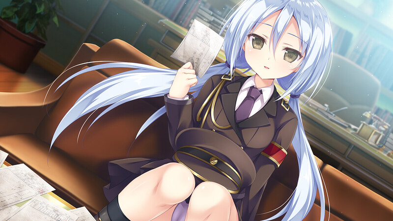

# 《さくらの雲＊スカアレットの恋》玩后感

## 剧透警告

## 通关概况
- 游戏线路：远子、莲、梅丽莎、所长四位女主，一周目为共通线强制Bad Ending，之后四条线分别对应四个周目，顺序不可调换
- 游玩时长：30h
## 感想
怎么说呢，通关《樱云》这部所谓的剧情作之后，我心情其实挺复杂的。一方面我特想给它吹爆，另一方面我又想揪着编剧的领子问他到底在想啥。

有一说一，这游戏的皮相是真的顶。那股子大正时代的风味儿，混着点穿越和悬疑，一下子就把格调拉满了，在现在一堆校园废萌gal里简直是一股清流。而且人设做得太好了，尤其是所长，我跟你说，这个角色塑造得也太神了！完全不按套路出牌，不是那种常见的姐姐系或者青梅系，就那么独一份儿，又飒又可靠，简直完美。就冲着这个背景和所长，我都觉得这游戏值了。

它确实有那么几个瞬间，让我觉得“卧槽，神作！”。比如梅丽莎线那个列车上的推理案，悬疑气氛拉满，解谜过程也挺像那么回事儿，最后揭露梅丽莎能力的时候，我整个人都惊了。还有最后所长线的大决战，抛开逻辑不谈，那场面确实够燃，最后的叙述性诡计也给了我个大惊喜。

但问题就出在这，这游戏越是把这些优点拍我脸上，我就越对它那烂到骨子里的内核感到愤怒。

这编剧冬茜，绝对是“文青病”入脑了。为了他那个所谓的“首尾呼应”和自我感动的悲剧结局，故事的逻辑性简直是稀烂。就拿梅丽莎线那个案子来说，明明车上还有一大堆乘务员和厨子，他非得把凶手范围锁死在乘客里。这种为了方便剧情强行设定的地方，游戏里多得数不清。

最离谱的是那个所谓的“历史误差”判定。凭什么反派加藤搞点事，历史就受不了了，我就回不去了；到我这儿，救人、阻止恐怖袭击、甚至直接把未来从世界大战扭转成和平世界，这么大的改变，系统却一点事没有，这也太双标了吧。

最后那个结局，更是为了悲剧而悲剧，强行喂刀。主角为什么要回去，铺垫了半天也没个站得住脚的理由，就硬生生为了一个所谓的“约定”、为了那份“浪漫”就走了，看得我莫名其妙。

还好当初听了劝，玩这游戏的时候基本没带脑子，我才能在它这一堆逻辑BUG里，尽可能地去享受它的美术、它的氛围和它的人物。

总的来说，这部720p的“剧情作”根本不合格，bgm上7.7分的评价也有些虚高了，剧情打得过9nine的评价也有些过了，还有什么剧情锁、一周目强行be、hcg集中爆发等等，我也懒得吐槽了，冬茜的写作水平也就这样了，已拉黑。

最后吐槽一下为什么阿良良木不能推啊！

